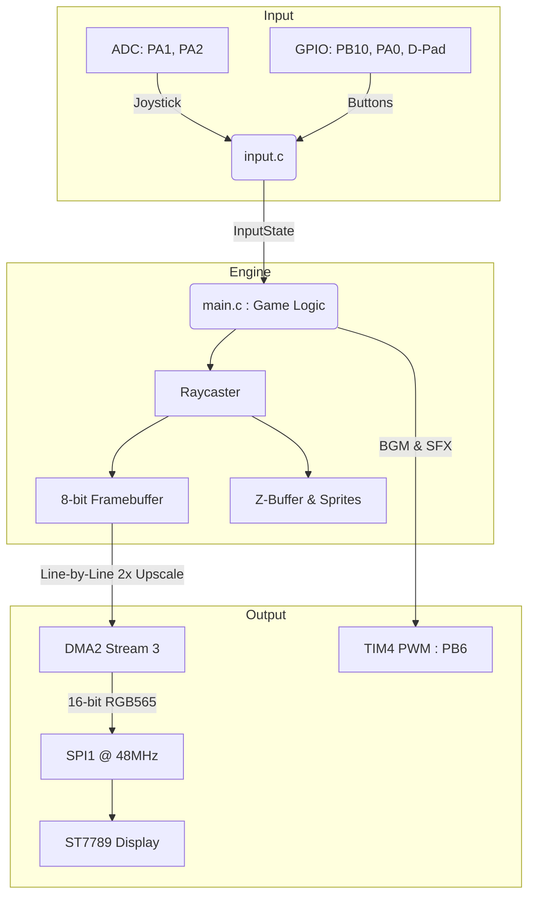

# Wolfenstein 3D - Bare Metal STM32F411CEU6 Port

A bare-metal, fully hardware-driven port of id Software's classic *Wolfenstein 3D* for the STM32F411CEU6 ("Black Pill") microcontroller.

This project was built entirely from scratch without an RTOS or standard hardware abstraction layers (HAL). It features a custom fixed-point raycasting engine, raw SPI display drivers, state-locking input fusion for physical D-Pads/Joysticks, a zero-CPU-overhead 8-bit piezo audio engine and runs incredibly fast within a 96MHz envelope.

> **Current Project Status:** At this time, the engine serves as a highly optimized technical showcase featuring **E1M1 (Episode 1, Map 1)** fully playable from start to finish.

---

## ✨ Key Engine Features
- **Custom Raycaster:** Highly optimized fixed-point math tailored for the ARM Cortex-M4.
- **Direct Hardware SPI:** Raw, DMA-assisted display driving to the ST7789 LCD.
- **8-Bit Piezo Audio Engine:** A custom, non-blocking hardware PWM sound system (TIM4) featuring a dual-layer audio priority system. Background music (BGM) seamlessly pauses for sound effects (SFX) and resumes automatically with 0% CPU overhead.
- **Input Fusion:** Auto-calibrating, state-locking input handler for physical joysticks and push buttons.

---

## System Architecture



---

## Memory Footprint (STM32F411CEU6)

The game runs entirely bare-metal and is highly optimized to fit within the constraints of the BlackPill's 512 KB Flash and 128 KB SRAM:

```text
Memory region      Used Size   Region Size   %age Used
       FLASH:       338.7 KB        512 KB      64.60%
        SRAM:        85.1 KB        128 KB      64.94%

   text    data     bss     dec     hex filename
 338376     324   84800  423500   6764c wolf3d_stm32f411ceu6.elf
```

---


## 🗂️ Repository Structure

### `stm32_port/`
The core game. A standalone, bare-metal C project tailored specifically for the STM32F411CEU6.

### `simulator/`
An SDL2-based PC prototype environment. Uses the exact same engine and rendering logic as the hardware port, allowing for rapid prototyping before flashing to the board.

### `hardware_tests/`
Individual hardware bring-up projects (Blinky, Screen, Joystick). Useful for verifying your wiring before running the full game.

### `tools/`
Python scripts used to parse, extract, and convert the original DOS `.WL1` asset files (maps, palettes, sprites) into optimized 8-bit C headers.

### `original_id_src/`
The untouched historical DOS C/ASM source code from id Software, preserved for reference.

---

## 🛠️ Hardware Requirements

- **MCU:** STM32F411CEU6 "Black Pill" Development Board  
- **Display:** SPI-based LCD (ST7789 LCD driver)  — see `stm32_port/connections.txt`
- **Audio:** Passive Piezo Speaker connected to PB6
- **Controls:** Analog Joystick / Tactile Push Buttons 

> **Note:** The engine features an automatic Input Fusion system. If an analog joystick is disconnected or broken, the engine will automatically default to D-Pad GPIO inputs.

---

## Hardware Wiring

| Signal         | STM32 Pin | Direction | Peripherals & Notes              |
|----------------|-----------|-----------|----------------------------------|
| **SPI_SCK** | PA5       | OUT       | SPI1 (AF5) - ST7789 Clock        |
| **SPI_MOSI** | PA7       | OUT       | SPI1 (AF5) - ST7789 Data         |
| **LCD_CS** | PA4       | OUT       | Active Low                       |
| **LCD_DC** | PB0       | OUT       | Data/Command Select              |
| **LCD_RST** | PB2       | OUT       | Active Low Hardware Reset        |
| **AUDIO_PWM** | PB6       | OUT       | TIM4_CH1 (AF2) - Piezo Buzzer    |
| **JOY_Y** | PA1       | IN (ADC)  | ADC1_CH1                         |
| **JOY_X** | PA2       | IN (ADC)  | ADC1_CH2                         |
| **BTN_FIRE** | PB10      | IN        | Internal Pull-up, Active Low     |
| **BTN_DOOR** | PA0       | IN        | Internal Pull-up, Active Low     |
| **DPAD_UP** | PB12      | IN        | Internal Pull-up, Active Low     |
| **DPAD_DOWN** | PB13      | IN        | Internal Pull-up, Active Low     |
| **DPAD_LEFT** | PB14      | IN        | Internal Pull-up, Active Low     |
| **DPAD_RIGHT** | PB15      | IN        | Internal Pull-up, Active Low     |

---

## 🚀 Building and Running

## 1. The PC Simulator (SDL2)

If you want to test engine modifications, collision detection, or rendering logic without flashing hardware, use the PC simulator.

### Requirements
- `gcc`
- `libsdl2-dev`

### Build & Run

```bash
cd simulator
gcc main.c -o wolf_test -O2 -lm $(sdl2-config --cflags --libs)
./wolf_test
```

## 2. The Bare-Metal STM32 Port

To build the actual game for hardware, you will need the `arm-none-eabi-gcc` toolchain and `stlink` utilities installed.

### Build & Flash

```bash
# Navigate to the standalone platform directory
cd stm32_port

# Build the binaries (.elf and .bin)
make

# Flash directly to the STM32 via ST-Link
st-flash write wolf3d_stm32f411ceu6.bin 0x08000000
```

## 3. Hardware Bring-up Tests

If your display is blank or inputs are not registering, verify hardware connections using the standalone tests.

```bash
cd hardware_tests/screen_blinky
make
st-flash write wolf3d_skeleton.bin 0x08000000
```

---

## 👾 Asset Extraction

The STM32 has limited flash memory, so the original `VSWAP.WL1` and `GAMEMAPS.WL1` files cannot be loaded directly. Instead, they are pre-processed into optimized C headers.

If you want to modify textures or levels:

1. Place the original *Wolfenstein 3D* `.WL1` files into:

   ```text
   tools/original_assets/
   ```

2. Run the Python extraction scripts:

   ```bash
   python3 map_visualizer.py
   python3 sprites_optimizer.py
   ```

3. The scripts will generate highly compressed `_8bit.h` files.

4. Replace the old headers inside:

   ```text
   stm32_port/include/
   ```

5. Recompile the project.

---

## 📜 Legal & Credits

### Port & Bare Metal Engine
Written by **PS_O5**.

### Original Game & Assets
*Wolfenstein 3D* is a registered trademark of id Software.

The source code in `original_id_src/` is provided under the terms of the original id Software release.

> All game assets (textures, maps, sprites) processed by the `tools/` directory require a legally obtained copy of the game.

## 🏛️ Original id Software Release

This repository is a derivative work based on the original 1995 public source code release of Wolfenstein 3D by id Software. The original documentation, historical notes, and compile guides for the DOS version have been preserved and can be found here:

* See [id-Software/wolf3d](https://github.com/id-Software/wolf3d) for the original repository.
* See [original_id_src/README/README.TXT](original_id_src/README/README.TXT) for the original release notes.
* See [original_id_src/README/LICENSE.DOC](original_id_src/README/LICENSE.DOC) for the historical licensing details.

